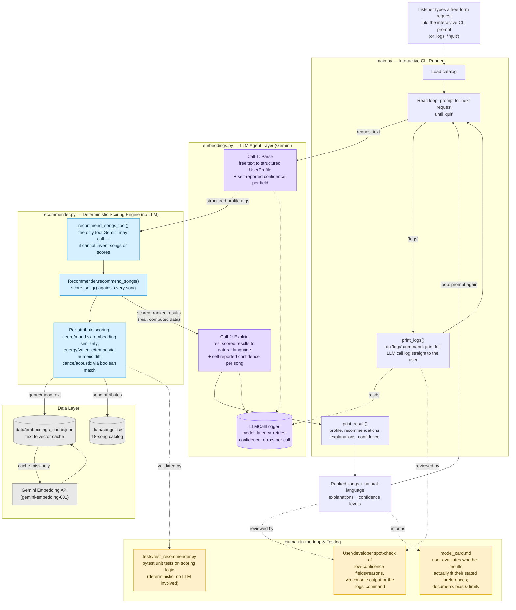

```mermaid
flowchart TD
    U["Listener types a free-form request<br/>into the interactive CLI prompt<br/>(or 'logs' / 'quit')"]

    subgraph Runner["main.py — Interactive CLI Runner"]
        M1["Load catalog"]
        M2["Read loop: prompt for next request<br/>until 'quit'"]
        M3["print_result()<br/>profile, recommendations,<br/>explanations, confidence"]
        M4["print_logs()<br/>on 'logs' command: print full<br/>LLM call log straight to the user"]
    end

    subgraph Agent["embeddings.py — LLM Agent Layer (Gemini)"]
        A1["Call 1: Parse<br/>free text to structured UserProfile<br/>+ self-reported confidence per field"]
        A2["Call 2: Explain<br/>real scored results to natural language<br/>+ self-reported confidence per song"]
        LOG[("LLMCallLogger<br/>model, latency, retries,<br/>confidence, errors per call")]
    end

    subgraph Scoring["recommender.py — Deterministic Scoring Engine (no LLM)"]
        R1["recommend_songs_tool()<br/>the only tool Gemini may call —<br/>it cannot invent songs or scores"]
        R2["Recommender.recommend_songs()<br/>score_song() against every song"]
        R3["Per-attribute scoring:<br/>genre/mood via embedding similarity;<br/>energy/valence/tempo via numeric diff;<br/>dance/acoustic via boolean match"]
    end

    subgraph Data["Data Layer"]
        D1[("data/songs.csv<br/>18-song catalog")]
        D2[("data/embeddings_cache.json<br/>text to vector cache")]
        D3["Gemini Embedding API<br/>(gemini-embedding-001)"]
    end

    subgraph Human["Human-in-the-loop & Testing"]
        H1["tests/test_recommender.py<br/>pytest unit tests on scoring logic<br/>(deterministic, no LLM involved)"]
        H2["User/developer spot-check of<br/>low-confidence fields/reasons,<br/>via console output or the<br/>'logs' command"]
        H3["model_card.md<br/>user evaluates whether results<br/>actually fit their stated preferences;<br/>documents bias & limits"]
    end

    U --> M1 --> M2
    M2 -- "request text" --> A1
    M2 -- "'logs'" --> M4
    M4 -.->|reads| LOG
    M4 --> M2
    A1 -- "structured profile args" --> R1
    R1 --> R2 --> R3
    R3 -- "genre/mood text" --> D2
    D2 -- "cache miss only" --> D3 --> D2
    R3 -- "song attributes" --> D1
    R2 -- "scored, ranked results<br/>(real, computed data)" --> A2
    A2 --> M3 --> OUT["Ranked songs + natural-language<br/>explanations + confidence levels"]
    OUT -- "loop: prompt again" --> M2

    A1 -.-> LOG
    A2 -.-> LOG

    R3 -.->|validated by| H1
    OUT -.->|reviewed by| H2
    M4 -.->|reviewed by| H2
    OUT -.->|informs| H3

    classDef ai fill:#e6d9ff,stroke:#8a5cf6,color:#2a1a4a;
    classDef deterministic fill:#d6f0ff,stroke:#2f9bd6,color:#0a2a3a;
    classDef human fill:#fff0cc,stroke:#e0a800,color:#4a3a00;
    classDef data fill:#e8e8e8,stroke:#888,color:#222;

    class A1,A2,LOG ai;
    class R1,R2,R3 deterministic;
    class H1,H2,H3 human;
    class D1,D2,D3 data;
```